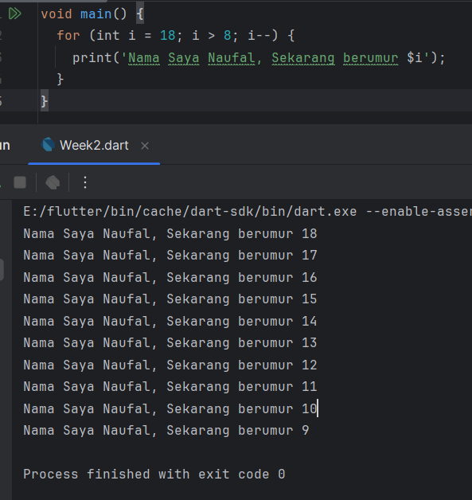

# Tugas Praktikum

## Soal 1
Modifikasilah kode pada baris 3 di VS Code atau Editor Code Favorit Anda berikut ini agar mendapatkan keluaran (output) sesuai yang diminta
> Jawab :
*Code and Hasil running* 

## Soal 2
Mengapa sangat penting untuk memahami bahasa pemrograman Dart sebelum kita menggunakan framework Flutter ? Jelaskan!
> Jawab :
> 1. Dasar dari Flutter: Dart adalah bahasa inti yang digunakan oleh Flutter. Dengan memahami Dart dapat lebih mudah memahami cara kerja Flutter.
> 2. Konsep Pemrograman: Dart mendukung konsep pemrograman berorientasi objek (OOP). Memahami konsep seperti kelas, objek, pewarisan, dan polimorfisme akan sangat membantu saat mengembangkan aplikasi dengan Flutter.
> 3. State Management: Pemahaman tentang manajemen status dalam Flutter, seperti StatefulWidget dan StatelessWidget, juga bergantung pada pemahaman Anda terhadap cara kerja kelas dan objek di Dart.

## Soal 3
Rangkumlah materi dari codelab ini menjadi poin-poin penting yang dapat Anda gunakan untuk membantu proses pengembangan aplikasi mobile menggunakan framework Flutter.
> Jawab :
> *Getting Started with Dart* 
Tujuan Dart adalah menggabungkan kelebihan dari sebagian besar bahasa tingkat tinggi dengan fitur-fitur Bahasa pemograman terkini, yaitu :
>- Productive Tooling : Dart menyediakan alat-alat produktif seperti analisis kode, plugin IDE, dan ekosistem paket yang besar.
>- Garbage Collection : Dart menangani dealokasi memori secara otomatis, terutama untuk objek yang tidak lagi digunakan.
>- Type Annotations (Opsional) : Dart menyediakan keamanan dan konsistensi dalam mengelola data, meskipun hal ini opsional.
>- Statically Typed : Dart menggunakan type-safe dan type inference untuk menemukan bug saat kompilasi, meskipun tipe data bersifat opsional
>- Portability : Dart dapat dikompilasi ke JS untuk web dan kode native untuk ARM dan x86
>- Relevansi Dart dengan Flutter : Pengembangan flutter sendiri sepenuhnya menggunakan dart, sehingga pemahaman tentang dart akan membuat pengembangan flutter lebih nyaman dan produktif.

>*The evolution of Dart*
>- Diluncurkan pada 2011 : Versi stabil dirilis pada tahun 2013, dengan perubahan besar pada dart 2.0 di akhir tahun 2018.
>- Peralihan fokus : Awalnya Dart untuk pengembangan web sebagai ganti JS, kini fokus pada pengembangan mobile, termasuk flutter
>- Memecahkan masalah JavaScript : Dart dirancang untuk memberikan ketangguhan yang tidak dimiliki JS, menjadi alternatif yang lebih baik
>- Performa dan Alat Modern : Dart menawarkan performa terbaik dan alat modern untuk berskala besar dengan plugin IDE yang stabil
>- Kuat dan Fleksibel : Menggabungkan type annotations opsional dan fitur OOP untuk keseimbangan fleksibilitas dan ketangguhan
>- Bahasa Modern dan Lintas Perform : Dart meningkatkan fitur-fiturnya untuk mendukung pengembangan lintas platform dengan fleksibilitas tinggi, membuatnya menjadi pilihan yang ideal untuk Flutter

>*How Dart Works*
>- Eksekusi kode dart : Dilakukan melalui dua cara, Dart Virtual Machines (VMs) dan JS compilations
>- Dua Mode Kompilasi Dart :
   Kompilasi JIT (Just-In-Time) : Kode sumber dikompilasi sesuai kebutuhan, digunakan untuk pengembangan aplikasi dengan fitur seperti debugging dan hot reload
   Kompilasi AOT (Ahead-Of-Time) : Kode dikompilasi sebelumnya, memberikan performa tinggi namun tanpa fitur debugging dan hot reload.
>- Lingkungan Dart : Eksekusi kode dart membutuhkan runtime systems, Dart core libraries, dan garbage collectors.