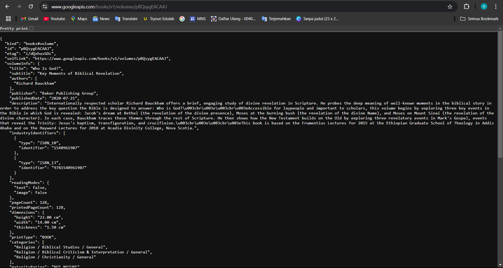
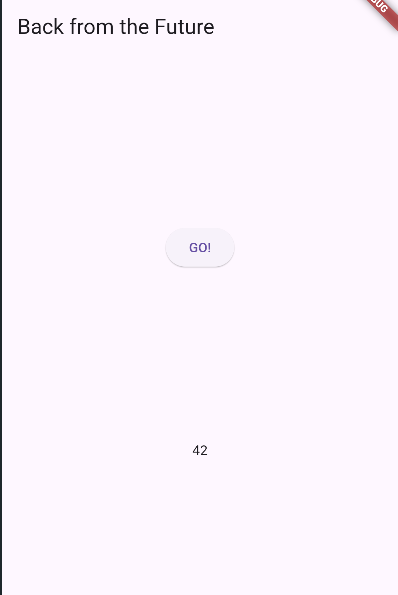

# Week 11 - Pemrograman Asynchronous
---

## Practicum 1 - Downloading Data from Web Services (API)
---

### Step 1: Create a New Project

Create a new flutter project named books in the src folder of week-11 of your GitHub repository.
Then add http dependency by typing the following command in the terminal.

```shell
flutter pub add http
```

### Step 2: Check the pubspec.yaml file

If the plugin is successfully installed, make sure the http plugin is in this pubspec file as
follows.

```shell
dependencies:
  flutter:
    sdk: flutter
    
  cupertino_icons: ^1.0.8
  http: ^1.2.2
```

### Step 3: Open the main.dart file

Type the code as follows.

1. Question 1
   Add your nickname to the app title as an identity for your work.

```dart
import 'dart:async';
import 'package:flutter/material.dart';
import 'package:http/http.dart';
import 'package:http/http.dart' as http;

void main() {
  runApp(const MyApp());
}

class MyApp extends StatelessWidget {
  const MyApp({super.key});

  @override
  Widget build(BuildContext context) {
    return MaterialApp(
      title: 'Naufal',
      theme: ThemeData(
        primarySwatch: Colors.blue,
      ),
      home: const FuturePage(),
    );
  }
}

class FuturePage extends StatefulWidget {
  const FuturePage({super.key});

  @override
  State<FuturePage> createState() => _FuturePageState();
}

class _FuturePageState extends State<FuturePage> {
  String result = '';

  @override
  Widget build(BuildContext context) {
    return Scaffold(
      appBar: AppBar(
        title: const Text('Back from the Future'),
      ),
      body: Center(
        child: Column(
          children: [
            const Spacer(),
            ElevatedButton(onPressed: () {}, child: const Text('Go')),
            const Spacer(),
            Text(result),
            const Spacer(),
            const CircularProgressIndicator(),
            const Spacer(),
          ],
        ),
      ),
    );
  }
}
```

### Step 4: Add the getData() method

Add this method to the _FuturePageState class which is useful for retrieving data from the Google
Books API.

```dart
Future<Response> getData() async {
  const authority = 'www.googleapis.com';
  const path = '/books/v1/volumes/pBQsygEACAAJ';

  Uri url = Uri.https(authority, path);
  return http.get(url);
}
```

2. Question 2

* Find your favorite book title on Google Books, then replace the book ID in the path variable in
  the code. The method is to take it from your browser URL as shown in the following image.
* Then try to access the complete URI in the browser like this. If it displays JSON data, then you
  have succeeded. Capture yours and write it in the README on the lab report. Then commit with the
  message "W11: Question 2".



### Step 5: Add code in ElevatedButton

Add code in onPressed in ElevatedButton as follows.

```dart
ElevatedButton(
  child: const Text('Go'),
  onPressed: () {
    setState(() {});
    getData().then((value) {
      result = value.body.toString().substring(0, 450);
      setState(() {});
    }).catchError((_) {
      result = 'An Error Occurred';
      setState(() {});
    });
  },
)
,
```

3. Question 3
    * Explain the purpose of the code in step 5 regarding substring and catchError!
    * Capture your lab results in GIF format and attach them to the README. Then commit with the
      message "W11: Question 3".

> * substring: This method is used to limit the number of characters displayed in the result string.
    > By using substring(0, 450), the code ensures that only the first 450 characters of the
    response body
    > are shown. This is useful for preventing the display of excessively long text, which might be
    > overwhelming or unnecessary for the user.
> * catchError: This method is used to handle any errors that occur during the data retrieval
    process.
    > If an error occurs while fetching data from the API, the catchError method will catch the
    error and
    > set the result string to "An Error Occurred". This provides a user-friendly message indicating
    that
    > something went wrong, instead of leaving the user with no feedback or a broken interface.
> * 


## Practicum 2 - Using await/async to avoid callbacks
---

### Step 1: Open the main.dart file

Add three methods containing code like the following inside the `_FuturePageState class`.

```dart
Future<int> returnOneAsync() async {
  await Future.delayed(const Duration(seconds: 3));
  return 1;
}

Future<int> returnTwoAsync() async {
  await Future.delayed(const Duration(seconds: 3));
  return 2;
}

Future<int> returnThreeAsync() async {
  await Future.delayed(const Duration(seconds: 3));
  return 3;
}
```

### Step 2: Add the count() method

Then add this method again below the previous three methods.

```dart
Future count() async {
  int total = 0;
  total = await returnOneAsync();
  total += await returnTwoAsync();
  total += await returnThreeAsync();

  setState(() {
    result = total.toString();
  });
```

### Step 3: Call count()

Comment out the previous code, change the contents of the onPressed() code to be as follows.

```dart
ElevatedButton(
  child: const Text('GO!'),
  onPressed: () {
    count();
  },
)
,
```

### Step 4: Run

Finally, run or press F5 if the application is not running yet. Then you will see the following
image, the result number 6 will appear after a delay of 9 seconds.


4. Question 4
   Explain the meaning of the code steps 1 and 2!
> * returnOneAsync, returnTwoAsync, returnThreeAsync: These methods wait for 3 seconds each and then return the values 1, 2, and 3.
> * count: This method calls all three asynchronous methods in sequence, sums the results, and updates the state with the total. The total time required is 9 seconds because each method waits for 3 seconds.


## Practicum 3 - Using Completer in Future
---

### Step 1: Open the main.dart file

Make sure you have imported the following async package.
```dart
import 'package:async/async.dart';
```

### Step 2: Add variables and methods
Add late variables and methods in the `_FuturePageState class` like this.

```dart
late Completer completer;

Future getNumber() {
  completer = Completer<int>();
  calculate();
  return completer.future;
}

Future calculate() async {
  await Future.delayed(const Duration(seconds : 5));
  completer.complete(42);
}
```

### Step 3 - Change the contents of the onPressed() code

Add the following code to the onPressed() function. You can comment out the previous code.

```dart
  onPressed: () {
    getNumber().then((value) {
      setState(() {
        result = value.toString();
      });
    });
  },
```

