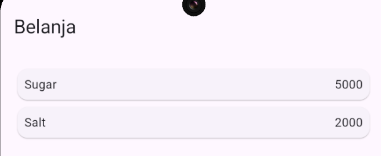
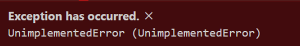
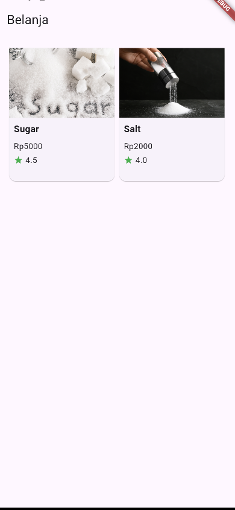
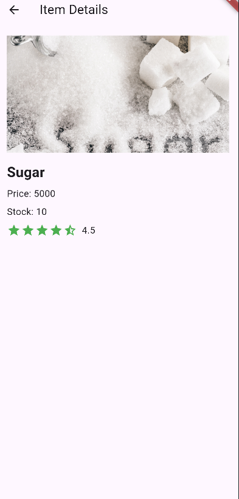
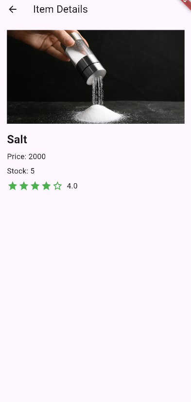

# **Practicum Week 6**

## **Practicum 5: Building Navigation in Flutter**

### **Step 2: Defining Routes**

Create two dart files named `home_page.dart` and `item_page.dart` in the pages folder. For each
file,
declare the `HomePage class` in the `home_page.dart` file and `ItemPage` in `item_page.dart`. Derive
the
class from `StatelessWidget`. You can see the code snippet as follows.

```dart
homepage.dart

class HomePage extends StatelessWidget {
  @override
  Widget build(BuildContext context) {
    throw UnimplementedError();
  }
}
```

```dart
item_page.dart

class ItemPage extends StatelessWidget {
  @override
  Widget build(BuildContext context) {
    throw UnimplementedError();
  }
}
```

### **Step 3: Complete the Code in `main.dart`**

After both pages have been created and defined, open the `main.dart` file. In this step you will
define the Route for both pages. The definition of route naming must be unique. The HomePage page is
defined as /. And the ItemPage page is defined as /item. To define the initial page, you can use the
`named argument initialRoute`. An overview of this stage can be seen in the following code snippet.

```dart
void main() {
  runApp(MaterialApp(
    initialRoute: '/',
    routes: {
      '/': (context) => HomePage(),
      '/item': (context) => ItemPage(),
    },
  ));
}
```

### **Step 4: Creating a data model**

Before moving the page from `HomePage` to `ItemPage`, a data modeling process is needed. In the
mockup
design, two pieces of information are needed, namely name and price. To handle this, create a file
named `item.dart` and place it in the models folder. In this file, the required data modeling is
defined. Illustrations of the required code can be seen in the following code snippet.

```dart
item.dart

class Item {
  String? name;
  int? price;

  Item({this.name, this.price});
}
```

### **Step 5: Complete the code on the Homepage**

Pada halaman `HomePage` terdapat `ListView` widget. Sumber data `ListView` diambil dari model List
dari
object Item. Gambaran kode yang dibutuhkan untuk melakukan definisi model dapat anda lihat sebagai
berikut.

```dart
import 'package:belanja/models/item.dart';
import 'package:flutter/material.dart';

class HomePage extends StatelessWidget {
  final List<Item> items = [
    Item(name: 'Sugar', price: 5000),
    Item(name: 'Salt', price: 2000),
  ];

  @override
  Widget build(BuildContext context) {
    throw UnimplementedError();
  }
}
```

### **Step 6: Creating ListView and itemBuilder**

To display `ListView` in this practicum, `itemBuilder` is used. Data is taken from the previously
created model definition. To show the data limit from one to the next, the `Card` widget is used.
The
code that is common in this section is not shown. You can see the description of the code needed as
follows.

```dart
home_page.dart

Widget

build(BuildContext context) {
  return Scaffold(
    appBar: AppBar(
      title: Text('Belanja'),
    ),
    body: Container(
      margin: EdgeInsets.all(8),
      child: ListView.builder(
        padding: EdgeInsets.all(8),
        itemCount: items.length,
        itemBuilder: (context, index) {
          final item = items[index];
          return Card(
            child: Container(
              margin: EdgeInsets.all(8),
              child: Row(
                children: [
                  Expanded(child: Text(item.name)),
                  Expanded(
                    child: Text(
                      item.price.toString(),
                      textAlign: TextAlign.end,
                    ),
                  )
                ],
              ),
            ),
          );
        },
      ),
    ),
  );
}
```

> Output :
> 

### **Step 7: Adding actions to ListView**

Items in the ListView currently do not provide a specific action when pressed. To add actions to
ListView, you can use the `InkWell` or `GestureDetector` widget. The main difference is
that `InkWell` is
a material widget that provides an effect when pressed. While `GestureDetector` is general and can
also be used for gestures other than touch. In this practicum, the `InkWell` widget will be used.

To add touch, place the cursor on the `Card` opening widget. Then use the quick fix shortcut from
VSCode (Ctrl + . on Windows or Cmd + . on MacOS). Highlight the `wrap with widget...` menu. Change
the
widget value to `InkWell` and add the named argument `onTap` which contains the function to move to
the
`ItemPage` page. You can see an illustration of the code snippet in the following snippet.

```dart
            return InkWell(
onTap: (){
Navigator.pushNamed(context, '/item');
},
```

> 

## **Practicum Task 2**

1. To send data to the next page, simply add arguments information to the `Navigator` usage. Update
   the code in the `Navigator` section to be as follows.

```dart
home_page.dart

return InkWell
(
onTap: (){
Navigator.pushNamed(context, '/item', arguments: item);
},
```

2. Reading the value sent on the previous page can be done using `ModalRoute`. Add the following
   code
   to the build function block in the `ItemPage` page. Once the value is obtained, you can use it
   like
   a regular variable.

```dart
item_page.dart

import 'package:flutter/material.dart';
import '/models/item.dart';

class ItemPage extends StatelessWidget {
  @override
  Widget build(BuildContext context) {
    final itemArgs = ModalRoute
        .of(context)!
        .settings
        .arguments as Item;

    return Scaffold(
      appBar: AppBar(
        title: const Text('Item Details'),
      ),
      body: Padding(
        padding: const EdgeInsets.all(16.0),
        child: Column(
          crossAxisAlignment: CrossAxisAlignment.start,
          children: [
            Text(
              itemArgs.name,
              style: const TextStyle(fontSize: 24, fontWeight: FontWeight.bold),
            ),
            const SizedBox(height: 8),
            Text(
              'Item Price: ${itemArgs.price}',
              style: const TextStyle(fontSize: 16),
            ),
          ],
        ),
      ),
    );
  }
}
```

3. In the final result of the shopping application that you have completed, add the attributes of
   product photos, stock, and ratings. Change the display to GridView like in the marketplace
   application in general.

```dart
item.dart

class Item {
  String name;
  int price;
  String image;
  int stock;
  double rating;

  Item({
    required this.name, 
    required this.price,
    required this.image,
    required this.stock,
    required this.rating
    });  
}
```
```dart
import 'package:belanja/models/item.dart';
import 'package:flutter/material.dart';

class HomePage extends StatelessWidget {
   final List<Item> items = [
      Item(
              name: 'Sugar',
              price: 5000,
              image: 'images/sugar.jpg',
              stock: 10,
              rating: 4.5),
      Item(
              name: 'Salt',
              price: 2000,
              image: 'images/salt.jpg',
              stock: 5,
              rating: 4.0),
   ];

   @override
   Widget build(BuildContext context) {
      return Scaffold(
         appBar: AppBar(
            title: const Text('Belanja'),
         ),
         body: Container(
            margin: const EdgeInsets.all(8),
            child: GridView.builder(
               padding: const EdgeInsets.all(8),
               gridDelegate: const SliverGridDelegateWithFixedCrossAxisCount(
                  crossAxisCount: 2, // Number of columns
                  childAspectRatio:
                  0.8, // Adjust aspect ratio to give more space vertically
               ),
               itemCount: items.length,
               itemBuilder: (context, index) {
                  final item = items[index];
                  return InkWell(
                     onTap: () {
                        Navigator.pushNamed(context, '/item', arguments: item);
                     },
                     child: Card(
                        child: Column(
                           crossAxisAlignment: CrossAxisAlignment.start,
                           children: [
                              Image.asset(item.image,
                                      height: 120, width: double.infinity, fit: BoxFit.cover),
                              Padding(
                                 padding: const EdgeInsets.all(8), // Padding around text
                                 child: Text(
                                    item.name,
                                    style: const TextStyle(
                                            fontSize: 16, fontWeight: FontWeight.bold),
                                 ),
                              ),
                              Padding(
                                 padding: const EdgeInsets.symmetric(horizontal: 8.0),
                                 child: Column(
                                    crossAxisAlignment: CrossAxisAlignment.start,
                                    children: [
                                       Text('Rp${item.price}',
                                               style: const TextStyle(fontSize: 14)),
                                       const SizedBox(height: 4),
                                       Row(
                                          children: [
                                             const Icon(Icons.star,
                                                     color: Colors.green, size: 16),
                                             const SizedBox(width: 4),
                                             Text(item.rating.toString(),
                                                     style: const TextStyle(fontSize: 14)),
                                          ],
                                       ),
                                    ],
                                 ),
                              ),
                           ],
                        ),
                     ),
                  );
               },
            ),
         ),
      );
   }
}

```

```dart
item_page.dart

import 'package:flutter/material.dart';
import '/models/item.dart';

class ItemPage extends StatelessWidget {
  @override
  Widget build(BuildContext context) {
    final itemArgs = ModalRoute.of(context)!.settings.arguments as Item;
    
    return Scaffold(
      appBar: AppBar(
        title: const Text('Item Details'),
      ),
      body: Padding(
        padding: const EdgeInsets.all(16.0),
        child: Column(
          crossAxisAlignment: CrossAxisAlignment.start,
          children: [
            Image.asset(
              itemArgs.image,
              height: 200,
              width: double.infinity,
              fit: BoxFit.cover,
            ),
            const SizedBox(height: 16),
            Text(
              itemArgs.name,
              style: const TextStyle(
                fontSize: 24,
                fontWeight: FontWeight.bold,
              ),
            ),
            const SizedBox(height: 8),
            Text(
              'Price: ${itemArgs.price}',
              style: const TextStyle(fontSize: 16),
            ),
            const SizedBox(height: 8),
            Text(
              'Stock: ${itemArgs.stock}',
              style: const TextStyle(fontSize: 16),
            ),
            const SizedBox(height: 8),
            Row(
              children: [
                Row(
                  children: List.generate(5, (index) {
                    if (index < itemArgs.rating.floor()) {
                      return const Icon(
                        Icons.star,
                        color: Colors.green,
                        size: 24,
                      );
                    } else if (index < itemArgs.rating) {
                      return const Icon(
                        Icons.star_half,
                        color: Colors.green,
                        size: 24,
                      );
                    } else {
                      return const Icon(
                        Icons.star_border,
                        color: Colors.green,
                        size: 24,
                      );
                    }
                  }),
                ),
                const SizedBox(width: 8),
                Text(
                  itemArgs.rating.toString(),
                  style: const TextStyle(fontSize: 16),
                ),
              ],
            ),
          ],
        ),
      ),
    );
  }
}
```
> Output :
> 
> 
> 