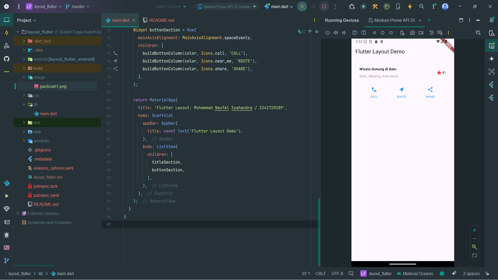
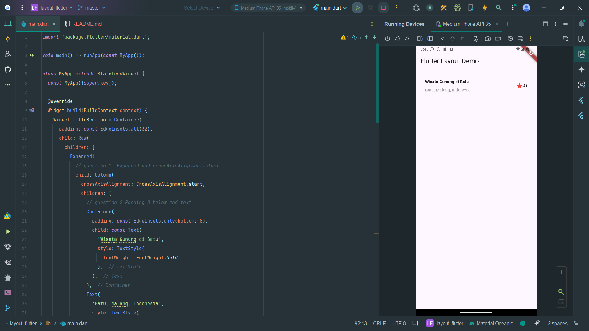
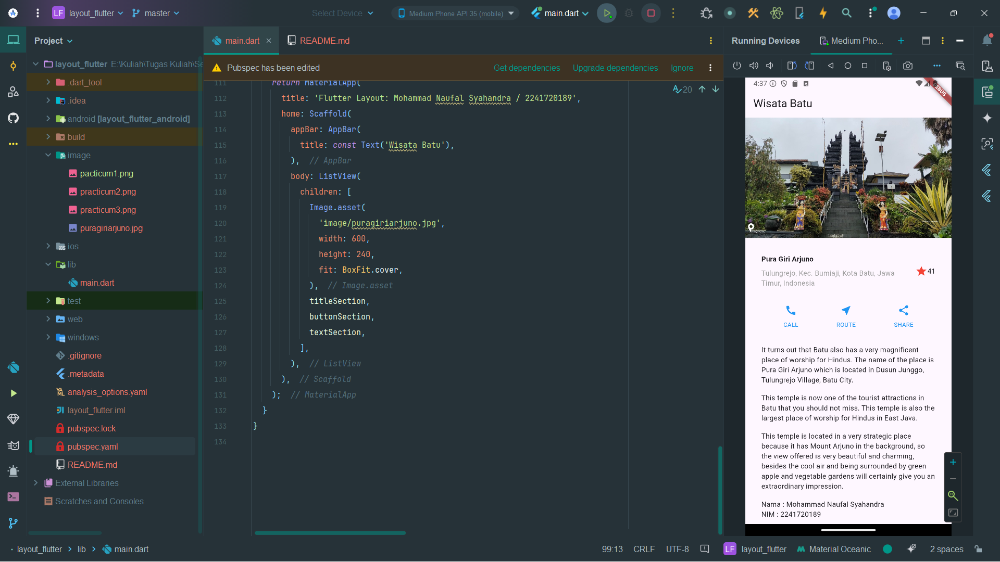

# **Practicum Week 6**

*Navigation Layout*

## **Practicum 1: Building Layouts in Flutter**

### **Step 4: Implement title row**

First, you will create the left column for the title. Add the following code at the top of the
build() method inside the MyApp class:

```dart

Widget titleSection = Container(
  padding: const EdgeInsets.all(...),
  child: Row(
    children: [
      Expanded(
        /* soal 1*/
        child: Column(
          crossAxisAlignment: ...,
          children: [
            /* soal 2*/
            Container(
              padding: const EdgeInsets.only(bottom: ...),
              child: const Text(
                'Wisata Gunung di Batu',
                style: TextStyle(
                  fontWeight: FontWeight.bold,
                ),
              ),
            ),
            Text(
              'Batu, Malang, Indonesia',
              style: TextStyle(...),
            ),
          ],
        ),
      ),
      /* soal 3*/
      Icon(
      ...,
      color: ...,
      ),
      const Text(),
    ],
  ),
);
```

1. Place the Column widget inside the Expanded widget to fit the remaining space inside the Row
   widget. Add the crossAxisAlignment property to CrossAxisAlignment.start so that the column
   position is at the beginning of the row.
2. Place the first line of text inside the Container so that you can add padding = 8. The text
   ‘Batu, Malang, Indonesia' inside the Column, set the color to gray.
3. The last two items in the title row are the star icon, set to red, and the text "41". The entire
   row is inside a Container and has 32 pixels of padding along each edge. Then replace the body
   text 'Hello World' with the titleSection variable

> Answer :

```dart
@override
Widget build(BuildContext context) {
  Widget titleSection = Container(
    padding: const EdgeInsets.all(32),
    child: Row(
      children: [
        Expanded(
          // question 1: Expanded and crossAxisAlignment.start
          child: Column(
            crossAxisAlignment: CrossAxisAlignment.start,
            children: [
              // question 2:Padding 8 below and text
              Container(
                padding: const EdgeInsets.only(bottom: 8),
                child: const Text(
                  'Wisata Gunung di Batu',
                  style: TextStyle(
                    fontWeight: FontWeight.bold,
                  ),
                ),
              ),
              Text(
                'Batu, Malang, Indonesia',
                style: TextStyle(
                  color: Colors.grey[500],
                ),
              ),
            ],
          ),
        ),
        // question 3: Red star icon and text '41'
        Icon(
          Icons.star,
          color: Colors.red[500],
        ),
        const Text('41'),
      ],
    ),
  );
```

> 

## **Practicum 2: Implementation button row**

### **Step 1: Create a Column buildButtonColumn method**

The button section contains 3 columns that use the same layout—an icon above a row of text. The
columns in this row are evenly spaced, and the text and icon are given a primary color.

Since the code to build each column is nearly identical, create a private helper method called
`buildButtonColumn()` , which takes a color, `Icon` and `Text` parameters, so it can return a column
with
its widgets in a specific color.

**lib/main.dart (buildButtonColumn)**

```dart
class MyApp extends StatelessWidget {
  const MyApp({super.key});

  @override
  Widget build(BuildContext context) {
    // ···
  }

  Column _buildButtonColumn(Color color, IconData icon, String label) {
    return Column(
      mainAxisSize: MainAxisSize.min,
      mainAxisAlignment: MainAxisAlignment.center,
      children: [
        Icon(icon, color: color),
        Container(
          margin: const EdgeInsets.only(top: 8),
          child: Text(
            label,
            style: TextStyle(
              fontSize: 12,
              fontWeight: FontWeight.w400,
              color: color,
            ),
          ),
        ),
      ],
    );
  }
}
```

> Answer :

```dart
Column buildButtonColumn(Color color, IconData icon, String label) {
  return Column(
    mainAxisSize: MainAxisSize.min,
    mainAxisAlignment: MainAxisAlignment.center,
    children: [
      Icon(icon, color: Colors.blue),
      Container(
        margin: const EdgeInsets.only(top: 8),
        child: Text(
          label,
          style: const TextStyle(
            fontSize: 12,
            fontWeight: FontWeight.w400,
            color: Colors.blue,
          ),
        ),
      ),
    ],
  );
}
```

### **Step 2: Create a buttonSection widget**

Create a Function to add icons directly to the columns. The text is inside a `Container` with margin
only at the top, separating the text from the icons.

Build the rows containing these columns by calling the function and setting the color, `Icon`, and
custom text through the parameters to the columns. Align the columns along the main axis using
`MainAxisAlignment.spaceEvenly` to evenly space the whitespace before, between, and after each
column.
Add the following code just below the `titleSection` declaration inside the `build()` method:

**lib/main.dart (buttonSection)**

```dart

Color color = Theme
    .of(context)
    .primaryColor;

Widget buttonSection = Row(
  mainAxisAlignment: MainAxisAlignment.spaceEvenly,
  children: [
    _buildButtonColumn(color, Icons.call, 'CALL'),
    _buildButtonColumn(color, Icons.near_me, 'ROUTE'),
    _buildButtonColumn(color, Icons.share, 'SHARE'),
  ],
);
```

> Answer :

```dart

Color color = Theme
    .of(context)
    .primaryColor;

Widget buttonSection = Row(
  mainAxisAlignment: MainAxisAlignment.spaceEvenly,
  children: [
    buildButtonColumn(color, Icons.call, 'CALL'),
    buildButtonColumn(color, Icons.near_me, 'ROUTE'),
    buildButtonColumn(color, Icons.share, 'SHARE'),
  ],
);
```

> 

## **Practicum 3: Implementation of text section**

### **Step 1: Create a textSection widget**

Define the text section as a variable. Put the text inside the `Container` and add padding along
each
edge. Add the following code just below the `buttonSection` declaration:

```dart

Widget textSection = Container(
  padding: const EdgeInsets.all(32),
  child: const Text(
    'Carilah teks di internet yang sesuai '
        'dengan foto atau tempat wisata yang ingin '
        'Anda tampilkan. '
        'Tambahkan nama dan NIM Anda sebagai '
        'identitas hasil pekerjaan Anda. '
        'Selamat mengerjakan 🙂.',
    softWrap: true,
  ),
);
```

By setting `softWrap` = true, the line of text will fill the width of the column before wrapping at
word boundaries.

> Answer :

```dart

Widget textSection = Container(
  padding: const EdgeInsets.all(32),
  child: const Column(
    crossAxisAlignment: CrossAxisAlignment.start,
    children: [
      Text(
        'It turns out that Batu also has a very magnificent place of worship for Hindus. The name of the place is Pura Giri Arjuno which is located in Dusun Junggo, Tulungrejo Village, Batu City.',
        softWrap: true,
      ),
      SizedBox(height: 16),
      Text(
        'This temple is now one of the tourist attractions in Batu that you should not miss. This temple is also the largest place of worship for Hindus in East Java.',
        softWrap: true,
      ),
      SizedBox(height: 16),
      Text(
        'This temple is located in a very strategic place because it has Mount Arjuno in the background, so the view offered is very beautiful and charming, besides the cool air and being surrounded by green apple and vegetable gardens will certainly give you an extraordinary impression.',
        softWrap: true,
      ),
      SizedBox(height: 16),
      Text(
          'Nama : Mohammad Naufal Syahandra'
      ),
      Text(
        'NIM : 2241720189',
      ),
    ],
  ),
);
```
```dart
return MaterialApp(
      title: 'Flutter Layout: Mohammad Naufal Syahandra / 2241720189',
      home: Scaffold(
        appBar: AppBar(
          title: const Text('Wisata Batu'),
        ),
        body: ListView(
          children: [
            Image.network(
              'https://pagaralampos.disway.id/upload/a600598f7acce3945686f023ca6569cf.jpg',
              width: 600,
              height: 240,
              fit: BoxFit.cover,
            ),
            titleSection,
            buttonSection,
            textSection,
          ],
        ),
      ),
    );
```

> 

## **Practicum 4: Implementation of image section**

> Answer :

> I have completed practicum 3 using `Image.network`
> 

> but if using Image.asset
```dart
return MaterialApp(
  title: 'Flutter Layout: Mohammad Naufal Syahandra / 2241720189',
  home: Scaffold(
    appBar: AppBar(
      title: const Text('Wisata Batu'),
    ),
  body: ListView(
    children: [
      Image.asset('image/puragiriarjuno.jpg',
        width: 600,
        height: 240,
        fit: BoxFit.cover,
      ),
        titleSection,
        buttonSection,
        textSection,
      ],
    );
  ),
),
```
> 
